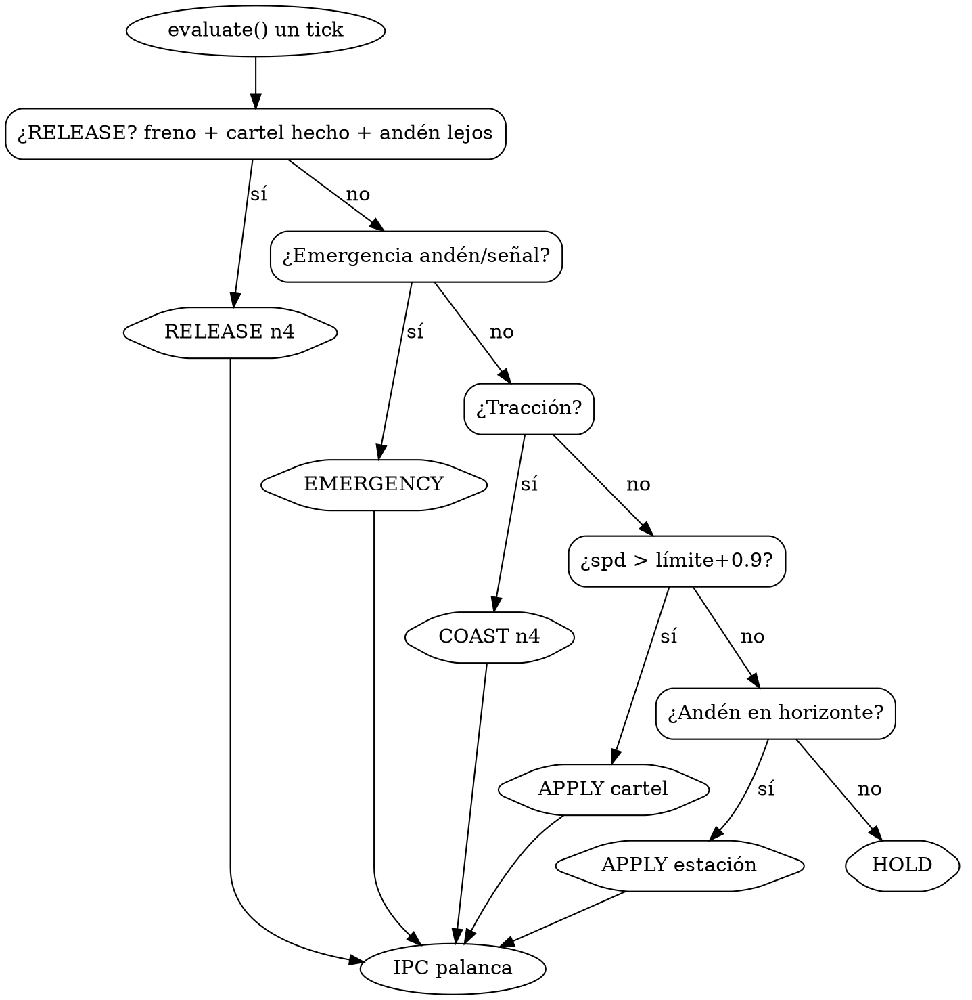
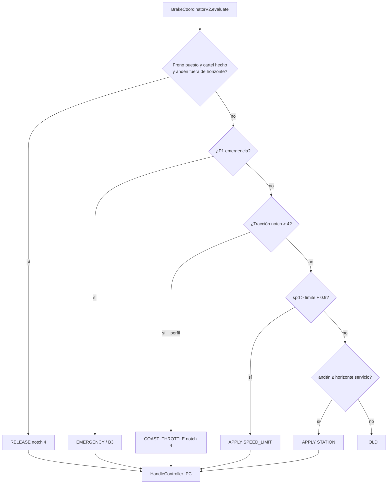

# Flujo de frenos — TSW6

Mapa de **quién manda** desde telemetría hasta la palanca. Si dos reglas
pueden aplicar a la vez, gana la **primera** de la escala de prioridad.
Detalle de física y módulos: [BRAKE_V2.md](BRAKE_V2.md).

Comparativa Nexus V4 (Dastsc): [COMPARATIVA_DASTSC_FLUJO.md](COMPARATIVA_DASTSC_FLUJO.md).

---

## ¿Está ordenado?

Sí a nivel **runtime P1**: un tick entra por `BrakeCoordinatorV2.evaluate` y
sale un solo `BrakeCommand` (`command_from_target`). No hay P2 ni `planner.py`.

El perfil de andén es `station_plan.py`; el cartel, `limit_brake.py`. Si una regla
“se pisa”, es porque se aplicó **fuera de orden**. La escala de abajo es la
fuente de verdad.

---

## Escala de prioridad (no se pisan)

Solo **una** sale. El resto del tick no manda palanca.

| # | Condición | Salida | Código |
| --- | --- | --- | --- |
| **0** | Watchdog / DMI / FSM estación (fuera de P1) | `BRAKE_FAST` / `HOLD` / `COAST` | `speed_decider.py` |
| **1** | Freno puesto, cartel hecho (`spd ≤ límite + 0,4`) y andén **fuera** de horizonte de servicio (`should_defer_station_brake`) | `RELEASE` notch 4 | `coordinator._attempt_release` |
| **2** | Andén o señal roja a distancia crítica | `EMERGENCY` / B3 | `objectives.check_p1_emergency` |
| **3** | Tracción (`notch > 4`) y perfil de cartel o `dist_start ≤ 800 m` | `COAST_THROTTLE` notch 4 | `command_from_target` |
| **4** | `spd > límite + 0,9` | `APPLY` SPEED_LIMIT B1–B3 | `limit_brake` + comando |
| **5** | Andén ≤ horizonte v→0 (+25 m) | `APPLY` STATION | `objectives.evaluate_station_brake` (si no diferido) |
| **6** | Nada de lo anterior | `HOLD` / `sin_plan_activo` | coordinador |

Constantes (`command.py` / `policy.py`):

- `LIMIT_RELEASE_MAX_OVER_MPH = 0.4` — soltar el cartel
- `LIMIT_SCORING_MAX_OVER_MPH = 0.9` — APPLY por exceso
- `HORIZON_SLACK_M = 25` — no B1 de andén hasta horizonte de **servicio** (decel 100 %, no B1 a 1,1 km)
- `TARGET_CLUSTER_GAP_M = 350` — cartel y andén “juntos”
- `uni=Y` — gap corto: no cabe 55 → soltar → parar en el hueco; el cartel marca el toque, el andén el v→0 **cuando entra horizonte**

---

## Visualización Graphviz

Fuente editable: [assets/flujo_frenos_p1.dot](assets/flujo_frenos_p1.dot)
([Graphviz](https://graphviz.org/), código en [GitLab](https://gitlab.com/graphviz/graphviz)).

No hace falta recompilar el autopilot: el `.dot` es el mapa de decisión.

```bat
winget install Graphviz.Graphviz
dot -Tsvg docs\assets\flujo_frenos_p1.dot -o docs\assets\flujo_frenos_p1.svg
dot -Tpng docs\assets\flujo_frenos_p1.dot -o docs\assets\flujo_frenos_p1.png
```

Vista previa en VS Code/Cursor: extensión Graphviz, o pegar el DOT en
[dreampuf.github.io/GraphvizOnline](https://dreampuf.github.io/GraphvizOnline/).



GitHub/Cursor también pintan Mermaid:



Diagramas de arquitectura (telemetría → GUI), no de prioridad P1:

| Tipo | Archivo |
| --- | --- |
| Módulos | [assets/esqueleto_arquitectura.svg](assets/esqueleto_arquitectura.svg) |
| Pasos 1→14 | [assets/esqueleto_flujo_cronologico.svg](assets/esqueleto_flujo_cronologico.svg) |
| Capas | [assets/esqueleto_flujo_capas.svg](assets/esqueleto_flujo_capas.svg) |

---

## Secuencia por ciclo (~20 Hz)

| Paso | Bloque | Módulo | Qué hace |
| --- | --- | --- | --- |
| **1** | LECTURA | `main.lua` | HUD + DriverAid → `GetData.txt` |
| **2** | LECTURA | `tsw_ue4ss_reader.py` | `ProbeSnapshot` |
| **3** | LECTURA | `tsw_telemetry_source.py` | Merge probe + HTTP + HUD DB |
| **4** | CICLO | `autopilot_core.tick()` | Bucle |
| **5** | CICLO | `build_train_state()` | `TrainState` |
| **6** | DECISIÓN | `speed_decider.decide()` | FSM → DMI → **P1** o `HOLD` |
| **7** | P1 | `evaluate()` | RELEASE si toca (escala #1) |
| **8** | P1 | `objectives.check_p1_emergency` | Crítico andén/señal (#2) |
| **9** | P1 | `limit_brake` / `objectives` | Candidatos |
| **10** | P1 | `policy.select_urgent_target` | Un objetivo |
| **11** | P1 | `command_from_target` | COAST / RELEASE / APPLY (#3–5) |
| **12** | EJECUCIÓN | `handle_controller.execute()` | Notch absoluto |
| **13** | EJECUCIÓN | `tsw_ipc_bus` | `SendCommand.txt` |
| **14** | JUEGO | `main.lua` | `PowerBrakeHandle` + ack |

Pasos 1–3: [ESTADO.md](ESTADO.md#árbol-cronológico--pasos-1-2-3-lectura).
4–6: [ESTADO.md](ESTADO.md#árbol-cronológico--pasos-4-5-6-ciclo--decisión).

---

## Capas por encima de P1 (no mezclar)

| Capa | Cuándo | Salida |
| --- | --- | --- |
| **FSM** | APPROACHING / STOPPED / DEPARTING | `HOLD` / `COAST` / techo `effective_limit` |
| **Marcador DMI** | `brake_marker_m` | `BRAKE` / `BRAKE_FAST` advisory |
| **P1** | Cartel / estación / señal | `BrakeCommand` IPC |
| **Sin plan P1** | Lejos | `HOLD` |
| **Watchdog** | +5 mph ≥ 3 s | `BRAKE_FAST` teclado |

Sin P2 (2026-08-25). [ESTADO.md](ESTADO.md#sin-p2-2026-08-25).

---

## Cómo leer un log

`logs/autopilot_*.log`:

| Campo | Significado |
| --- | --- |
| `p1cmd=RELEASE` / `APPLY` / `COAST` | Escalón que ganó |
| `p1tgt=SPEED_LIMIT/B1` | Objetivo y fase |
| `p1ds=` | `dist_start` m (negativo = tarde) |
| `uni=Y` | Cluster cartel+andén |
| `gap=` | estación − cartel (m) |
| `release_blocked:station` | Andén ya en horizonte; no soltar |
| `release_blocked:unified_stop` | Parada unificada y sin holgura |
| `sin_plan_activo` | Escala #6 |

Ejemplo coherente Four Oaks (55 + andén ~250 m detrás):

1. Coast al acercarse al 55 con tracción.
2. APPLY B1 solo si `spd > 55,9`.
3. `RELEASE` al volver a ≤ 55,4 si el andén aún está fuera de horizonte (~500 m a 55 mph).
4. APPLY estación cuando `parada ≤ horizonte + 25 m`.

Si ves B1 desde 650 m hasta parado: el escalón 1 no ganó (andén ya “dentro” o RELEASE bloqueado).

---

## Archivos clave

| Archivo | Rol |
| --- | --- |
| `tsw6/braking/v2/coordinator.py` | Orquestación; escala 1–6 |
| `tsw6/braking/v2/command.py` | `command_from_target` (único APPLY/RELEASE/COAST) |
| `tsw6/braking/v2/policy.py` | Unificado, defer horizonte, qué candidato gana |
| `tsw6/autopilot/handle_controller.py` | Ejecuta notch |
| `tsw6/telemetry/tsw_ipc_bus.py` | IPC |
| `docs/assets/flujo_frenos_p1.dot` | Grafo Graphviz |
| [BRAKE_V2.md](BRAKE_V2.md) | Física, ventana APPLY, módulos |
